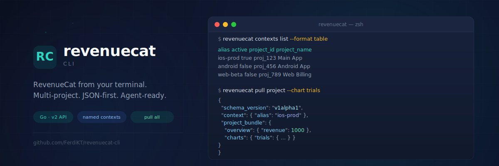

<p align="center">
  
</p>

<h1 align="center">revenuecat</h1>

<p align="center">
  <strong>An agent-first CLI for RevenueCat</strong><br />
  Multi-project · JSON-first · CI-friendly · OAuth-first
</p>

<p align="center">
  <a href="#-status"></a>
  <a href="#-installation"></a>
  <a href="#-quickstart"></a>
  <a href="#-why-revenuecat"></a>
  <a href="#-auth-model"></a>
  <a href="#-license"></a>
</p>

---

## ⚠️ Status

> **This project is in public beta.** OAuth login with PKCE is the recommended path today for RevenueCat account-level and project-scoped workflows. API-key contexts remain supported for named aliases, fixed project bindings, and `pull all`.

---

## ✨ Why revenuecat?

> Stop swapping tokens and MCP configs. Start **operating every RevenueCat project from one CLI.**

| | |
|---|---|
| 🔐 **OAuth login** | Recommended auth path with PKCE and OS credential-store token storage |
| 🧭 **Named contexts** | Optional API-key aliases for fixed project shortcuts and `pull all` |
| 🔐 **Secret storage** | API keys and OAuth tokens live in the OS credential store |
| 🤖 **Agent-first output** | Deterministic JSON envelopes for LLMs, scripts, and CI |
| 📦 **Project snapshots** | `pull project` and `pull all` for fast planning and comparison |
| 📊 **Metrics built in** | Overview and chart endpoints without hand-rolled curl calls |
| 🛠️ **Precise CRUD** | Apps, entitlements, products, offerings, packages, paywalls, customers, subscriptions, purchases |

---

## 📦 Installation

<details open>
<summary><strong>Option 1 — Homebrew</strong> (recommended)</summary>

```bash
brew tap FerdiKT/homebrew-tap
brew install revenuecat
```

</details>

<details>
<summary><strong>Option 2 — Go install</strong></summary>

```bash
go install github.com/FerdiKT/revenuecat-cli/cmd/revenuecat@latest
```

</details>

<details>
<summary><strong>Option 3 — Build from source</strong></summary>

```bash
git clone https://github.com/FerdiKT/revenuecat-cli.git
cd revenuecat-cli
make build VERSION=v0.3.1
./bin/revenuecat version
```

</details>

<details>
<summary><strong>Option 4 — Local install for testing</strong></summary>

```bash
git clone https://github.com/FerdiKT/revenuecat-cli.git
cd revenuecat-cli
make install-local PREFIX="$(pwd)/.local-dev" VERSION=local
./.local-dev/bin/revenuecat version
```

</details>

---

## 🚀 Quickstart

Get up and running in **5 minutes**.

### 1️⃣ Log in with OAuth

```bash
revenuecat auth login
```

### 2️⃣ Discover or create a project

```bash
revenuecat auth status
revenuecat projects list
revenuecat projects create --name "Main iOS App"
```

### 3️⃣ Pull the current project snapshot

```bash
revenuecat pull project --project-id proj_123 --chart trials
```

### 4️⃣ Resolve an app and inspect country metrics

```bash
revenuecat apps resolve --project-id proj_123 --bundle-id app.ferdi.headson
revenuecat metrics countries revenue \
  --project-id proj_123 \
  --app app_1 \
  --start 2026-01-01 \
  --end 2026-04-16
```

### 5️⃣ Optional: add an API-key context for shortcuts and `pull all`

```bash
revenuecat contexts add ios-prod \
  --api-key sk_your_project_secret_key \
  --project-id proj_123 \
  --project-name "Main iOS App" \
  --active
```

### 6️⃣ Compare every configured project with contexts

```bash
revenuecat pull all --include-customers
```

### 7️⃣ Create resources with JSON payloads

```bash
revenuecat entitlements create --project-id proj_123 --data '{"lookup_key":"pro","display_name":"Pro Access"}'
revenuecat offerings create --project-id proj_123 --file ./payloads/offering-create.json
```

---

## 🗺️ Command Map

<table>
  <thead>
    <tr>
      <th>Group</th>
      <th>Commands</th>
      <th>Highlights</th>
    </tr>
  </thead>
  <tbody>
    <tr>
      <td><code>projects</code></td>
      <td>list · get · create</td>
      <td>OAuth-backed account-level project discovery and creation</td>
    </tr>
    <tr>
      <td><code>contexts</code></td>
      <td>add · list · use · show · remove · verify</td>
      <td>Optional API-key aliases, active context switching, and <code>pull all</code></td>
    </tr>
    <tr>
      <td><code>auth</code></td>
      <td>status · login · logout</td>
      <td>OAuth login with PKCE plus status/logout</td>
    </tr>
    <tr>
      <td><code>apps</code></td>
      <td>list · get · create · update · delete · resolve · public-keys · storekit-config</td>
      <td>App metadata, public SDK keys, StoreKit config, bundle-id lookup, and guarded deletion</td>
    </tr>
    <tr>
      <td><code>entitlements</code></td>
      <td>list · get · create · update · archive · unarchive · attach-products · detach-products</td>
      <td>Access model management</td>
    </tr>
    <tr>
      <td><code>products</code></td>
      <td>list · get · create · update · archive · unarchive</td>
      <td>Catalog management</td>
    </tr>
    <tr>
      <td><code>offerings</code></td>
      <td>list · get · create · update · archive · unarchive</td>
      <td>Paywall-ready offering workflows</td>
    </tr>
    <tr>
      <td><code>packages</code></td>
      <td>list · get · create · update · attach-products · detach-products</td>
      <td>Offering package management</td>
    </tr>
    <tr>
      <td><code>paywalls</code></td>
      <td>list · get · create · delete</td>
      <td>Paywall configuration with guarded deletion</td>
    </tr>
    <tr>
      <td><code>metrics</code></td>
      <td>overview · chart · countries · options</td>
      <td>Overview KPIs, raw chart reads, and country breakdown tables</td>
    </tr>
    <tr>
      <td><code>customers</code>, <code>subscriptions</code>, <code>purchases</code></td>
      <td>list · get</td>
      <td>Customer-side inspection for support and analytics</td>
    </tr>
    <tr>
      <td><code>pull</code></td>
      <td>project · all</td>
      <td>Normalized agent snapshots</td>
    </tr>
    <tr>
      <td><code>version</code></td>
      <td>—</td>
      <td>Build and release metadata</td>
    </tr>
  </tbody>
</table>

---

## 🤖 Agent Workflow

Use this pattern for Codex, Claude, Cursor, or internal agents:

1. Resolve the target project with `revenuecat projects list`, `--project-id`, or `--context`.
2. Pull current state first with `revenuecat pull project` or `revenuecat pull all`.
3. Plan mutations from the snapshot instead of guessing.
4. Use resource-specific `create`, `update`, `archive`, attach/detach, or guarded delete commands with JSON payloads.
5. Keep `--all-contexts` read-only and use it only with configured API-key contexts.

Repo-local guidance also lives in [`AGENTS.md`](AGENTS.md) and [`skills/revenuecat-cli/SKILL.md`](skills/revenuecat-cli/SKILL.md).

For metrics charts that need complex RevenueCat filters or selectors, you can pass raw JSON directly instead of shell-fragile `--param` values:

```bash
revenuecat metrics chart revenue \
  --context ios-prod \
  --filters-json '[{"name":"app_id","values":["app_1"]},{"name":"store","values":["app_store"]}]' \
  --selectors-json '{"revenue_type":"revenue"}'
```

To install the bundled Codex skill directly from the CLI:

```bash
revenuecat agent install-skill
```

For local development, if you want a symlink instead of a copied install:

```bash
revenuecat agent link-skill --source ./skills/revenuecat-cli
```

---

## 🔐 Auth Model

The recommended path today is **OAuth with PKCE**.

- `revenuecat auth login` uses the shared public OAuth client with PKCE.
- `revenuecat projects list`, `revenuecat projects get <project_id>`, and `revenuecat projects create --name "Project Name"` use OAuth for account-level workflows.
- Project-scoped commands can use OAuth directly by passing `--project-id <project_id>`.
- Expired OAuth access tokens are refreshed automatically when a refresh token is available.
- OAuth access and refresh tokens are stored in the OS credential store: macOS Keychain, Windows Credential Manager, or Linux Secret Service.
- The local config file stores context and OAuth metadata only, not API keys or OAuth tokens.
- API-key contexts remain supported for named aliases, fixed project bindings, and `pull all`.
- Active context is the default target for API-key workflows.
- `--context <alias>` overrides the active API-key context.
- `--all-contexts` fans out read-only commands across every configured API-key context.
- API keys are stored in the OS credential store; legacy config files with inline `api_key` values are migrated on first load.
- On Linux, a Secret Service provider such as GNOME Keyring, KWallet, or KeePassXC Secret Service must be available.

### Destructive Commands

`apps delete <app_id>` and `paywalls delete <paywall_id>` are intentionally guarded for agent safety and require an exact confirmation flag:

```bash
revenuecat apps delete app_123 --context ios-prod --confirm app_123
revenuecat paywalls delete paywall_123 --context ios-prod --confirm paywall_123
```

---

## 🧪 Development

```bash
make test
make build VERSION=v0.3.1
make install-local PREFIX="$(pwd)/.local-dev" VERSION=local
make dist VERSION=v0.3.1
```

---

## 📄 License

MIT. See [LICENSE](LICENSE).
